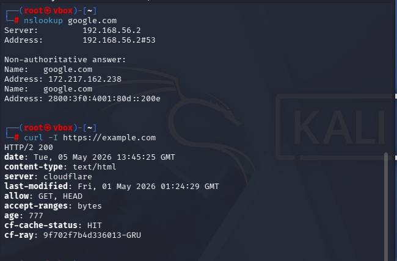
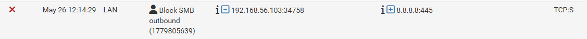
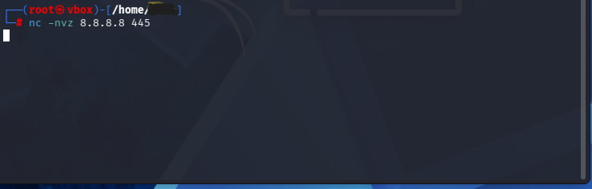
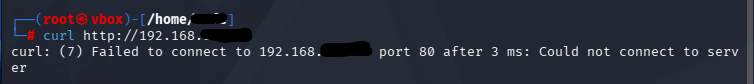
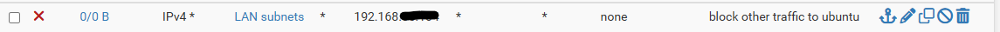
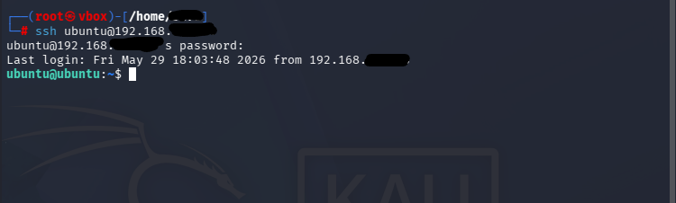
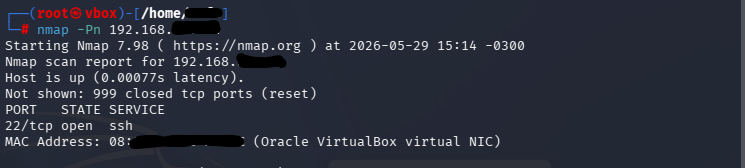
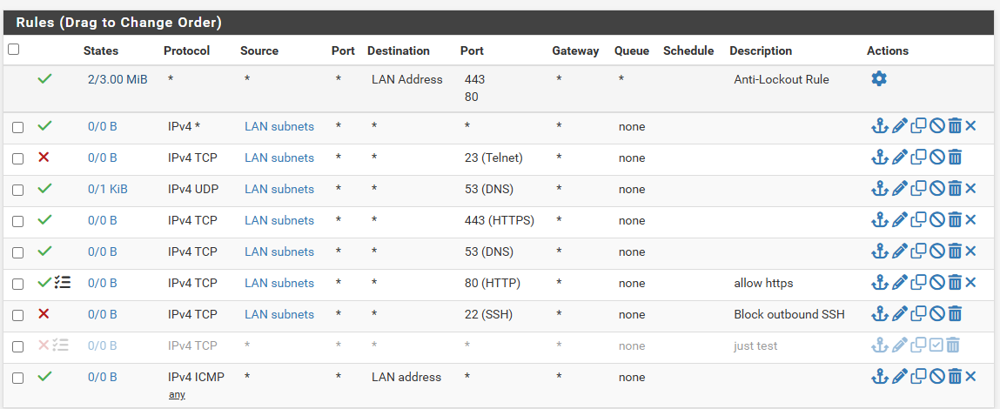

                                                OVERVIEW
                                                
##########################################################################################################################################

This project demonstrates the implementation of network segmentation and firewall policies using pfSense in a virtualized lab environment.

The objective was to create a controlled network where access to a protected Ubuntu Server is restricted according to the principle of least privilege.

##########################################################################################################################################

ENVIRONMENT:

-pfSense Firewall

-Kali Linux

-Ubuntu Server

-VirtualBox

NETWORK ARCHITECTURE:

Kali Linux (192.168.56.103)

↓

pfSense Firewall (192.168.56.2)

↓

Ubuntu Server (192.168.56.104)

IMPLEMENTED CONTROLS (RULES):

--Http and dns allowed rule--

Protocol: TCP

Source: LAN Subnet

Protocol: Any

Destination: Any

Destination Port: 53 and 80

Action: Pass

Test on kali:                                                                                                                           

success!

--Traffic blocked rule: SMB--

log  SMB timeout:

test on kali(timeout):

Success!

--Http blocked rule--

Protocol: TCP

Source: LAN Subnet

Protocol: Any

Destination: Ubuntu Server

Destination Port: 22

Action: Block

Block Unauthorized Traffic

test on kali terminal:

--Other traffic blocked rule--

Protocol: TCP

Source: LAN Subnet

Protocol: Any

Destination: Ubuntu Server

Destination Port: any

Action: Block

Block Unauthorized Traffic

Rule image:

--SSH allowed rule--

Protocol: TCP

Source: LAN Subnet

Protocol: Any

Destination: Ubuntu Server

Destination Port: 22

Action: Pass

Allow SSH Access only

Rule image:

test on kali terminal:

nmap test on kali terminal - only  ssh open:

--All Rules--

Traffic was monitored through pfSense firewall logs to validate policy enforcement.

Security Concepts Demonstrated
Network Segmentation
Firewall Rule Management
Traffic Filtering
Log Analysis
Secure Remote Administration
Screenshots

See the screenshots folder for evidence of configuration and validation tests.
